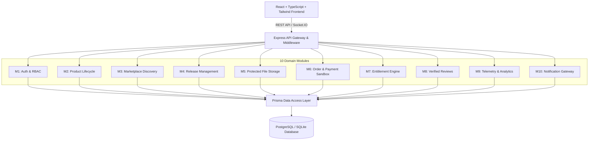

# ProductForge: Cloud-Based Digital Product Marketplace and Lifecycle Management Platform

[](https://opensource.org/licenses/MIT)
[](https://nodejs.org/)
[](https://www.typescriptlang.org/)
[](https://www.prisma.io/)
[](https://react.dev/)
[](https://tailwindcss.com/)

> **Academic Submission:** University Back-end Engineering (BEE) Course  
> **Architecture:** Modular Monolith with Layered Clean Architecture & Real-Time Telemetry

---

## 📌 Project Overview & Problem Statement

Independent developers, SaaS creators, and engineers build valuable software assets (CLI tools, microservice APIs, SaaS templates, UI kits, browser extensions), yet traditional e-commerce platforms treat digital software as static files. They lack:
- Release versioning & SemVer management ($v1.0.0 \rightarrow v1.1.0$).
- Visual product lifecycle pipelines (`DRAFT` $\rightarrow$ `BETA` $\rightarrow$ `PUBLISHED` $\rightarrow$ `ARCHIVED`).
- Cryptographic license key issuance (`PF-XXXX-XXXX-XXXX`).
- Protected, entitlement-gated binary delivery.
- Real-time customer telemetry and release notifications.

**ProductForge** solves this by bridging software release engineering with developer commerce.

---

## 🏗️ System Architecture

ProductForge employs a clean **Modular Monolith** architecture:



---

## 👥 Academic Team Module Responsibilities

| Team Member | Module Ownership | Key Responsibilities |
| :--- | :--- | :--- |
| **Team Member 1** | **M1: Auth, M2: Lifecycle, M3: Marketplace, M4: Releases, M5: Files** | Authentication & RBAC, product lifecycle state machine (`DRAFT` $\rightarrow$ `PUBLISHED`), marketplace search/filter, SemVer release engineering, path-traversal protected binary asset delivery |
| **Team Member 2** | **M6: Orders, M7: Entitlements, M8: Reviews, M9: Telemetry, M10: Notifications** | Sandbox checkout & order processing, cryptographic license key generator (`PF-XXXX-XXXX`), customer library aggregation, verified-buyer review gating, creator telemetry dashboards, Socket.IO real-time notifications |

---

## 🚀 Quickstart & Setup Guide

### 1. Prerequisites
- **Node.js** $\ge 18.0.0$
- **npm** $\ge 9.0.0$

### 2. Backend Setup
```bash
cd backend
npm install
npx prisma db push
npm run prisma:seed
npm run dev
```
*Backend server will start at `http://localhost:5000` with WebSocket gateway attached.*

### 3. Frontend Setup
```bash
cd frontend
npm install
npm run dev
```
*Frontend application will start at `http://localhost:5173`.*

---

## 🔑 Pre-Seeded Demo Credentials

| Role | Email | Password | Access Capabilities |
| :--- | :--- | :--- | :--- |
| **Creator** | `alex@forgeflow.dev` | `Password123!` | Access Creator Studio, manage lifecycle pipeline, publish releases, view telemetry |
| **Buyer / Customer** | `jordan@buyer.com` | `Password123!` | Browse marketplace, purchase with sandbox, download binary releases, submit reviews |
| **Administrator** | `admin@productforge.io` | `Password123!` | Global moderation, user management, platform metrics |

---

## 🧪 Automated Testing
Run the backend test suite covering all 10 domain modules:
```bash
cd backend
npm test
```
Result: **10/10 PASS** (Health check, Auth, Marketplace, Categories, Slugs, Entitlements, Telemetry, Sandbox Checkout, Notifications).

---

## 📚 Complete Project Documentation

Detailed university-grade documentation is located in the [`docs/`](./docs) folder:
- [`docs/requirements.md`](./docs/requirements.md) — Problem statement & core objectives
- [`docs/functional-requirements.md`](./docs/functional-requirements.md) — 25+ detailed functional requirements
- [`docs/non-functional-requirements.md`](./docs/non-functional-requirements.md) — Security, latency, and reliability specifications
- [`docs/architecture.md`](./docs/architecture.md) — High-level diagrams, layered models & sequence flows
- [`docs/database.md`](./docs/database.md) — ER diagrams, table schemas, relationships & indices
- [`docs/api.md`](./docs/api.md) — REST API endpoint contract
- [`docs/module-division.md`](./docs/module-division.md) — Domain module isolation
- [`docs/project-workflow.md`](./docs/project-workflow.md) — State machines & customer acquisition flow
- [`docs/team-contributions.md`](./docs/team-contributions.md) — Team member assignment matrix

---

## 📄 License
MIT License. Open-source for academic and educational engineering projects.
