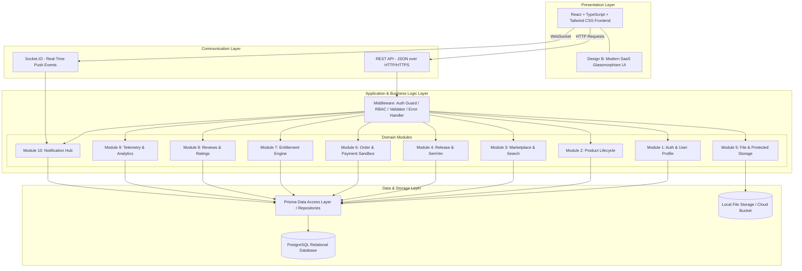
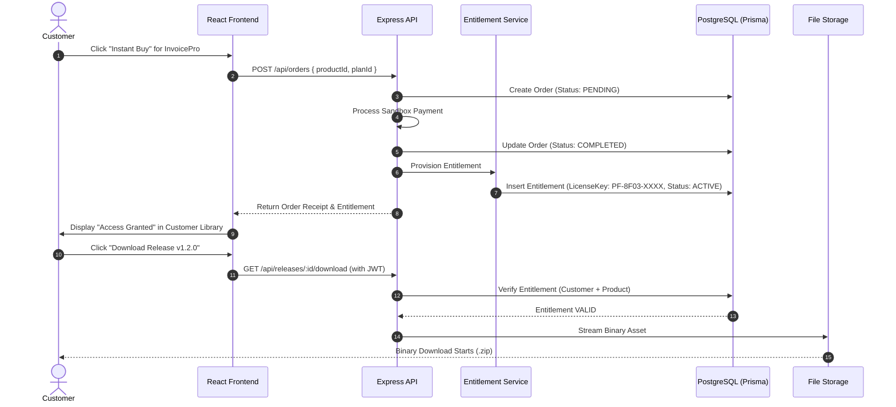

# ProductForge: System Architecture & Design

## 1. High-Level Architectural Model

ProductForge is built as a **Modular Monolith** system designed for high developer productivity, clear domain boundaries, and straightforward deployment.



---

## 2. Layered Component Architecture

Every module strictly adheres to the 4-layer separation:

```text
Request (Client)
      ↓
[ Route Layer ]       --> URL mapping, HTTP verbs, auth middleware
      ↓
[ Controller Layer ]  --> Request parsing, schema validation, HTTP responses
      ↓
[ Service Layer ]     --> Pure business rules, lifecycle transitions, calculations
      ↓
[ Repository Layer ]  --> Prisma ORM data queries, database transactions
      ↓
Response (JSON)
```

---

## 3. Data Flow: End-to-End Product Purchase & Release Access


