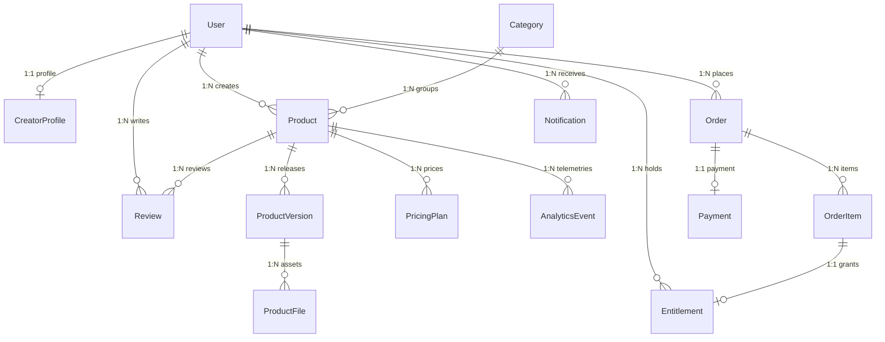

# ProductForge: Relational Database Design & Schema

## 1. Entity-Relationship (ER) Overview

ProductForge uses PostgreSQL as its primary ACID-compliant relational data store with Prisma ORM.

---

## 2. Table Schemas & Definitions

### 1. `User` Table
| Column | Type | Constraints | Description |
| :--- | :--- | :--- | :--- |
| `id` | String (CUID/UUID) | PRIMARY KEY | Unique user identifier |
| `email` | String | UNIQUE, NOT NULL | Account login email |
| `passwordHash` | String | NOT NULL | Bcrypt salted hash |
| `name` | String | NOT NULL | Display name |
| `role` | Enum (`CUSTOMER`, `CREATOR`, `ADMIN`) | DEFAULT `CUSTOMER` | User access role |
| `avatarUrl` | String | NULLABLE | Profile picture URL |
| `createdAt` | DateTime | DEFAULT now() | Account creation time |
| `updatedAt` | DateTime | AUTO UPDATE | Last update timestamp |

### 2. `CreatorProfile` Table
| Column | Type | Constraints | Description |
| :--- | :--- | :--- | :--- |
| `id` | String | PRIMARY KEY | Unique profile ID |
| `userId` | String | UNIQUE, FK $\rightarrow$ `User.id` | Associated creator user |
| `bio` | String | NULLABLE | Professional bio |
| `website` | String | NULLABLE | Personal or portfolio site |
| `githubUrl` | String | NULLABLE | GitHub profile handle |
| `rating` | Float | DEFAULT 0.0 | Overall creator rating |

### 3. `Category` Table
| Column | Type | Constraints | Description |
| :--- | :--- | :--- | :--- |
| `id` | String | PRIMARY KEY | Unique category ID |
| `name` | String | UNIQUE, NOT NULL | Category name (e.g. SaaS, APIs) |
| `slug` | String | UNIQUE, NOT NULL | URL-safe slug |
| `icon` | String | NOT NULL | Icon identifier |
| `description` | String | NULLABLE | Category description |

### 4. `Product` Table
| Column | Type | Constraints | Description |
| :--- | :--- | :--- | :--- |
| `id` | String | PRIMARY KEY | Unique product ID |
| `creatorId` | String | FK $\rightarrow$ `User.id` | Author creator |
| `categoryId` | String | FK $\rightarrow$ `Category.id` | Product category |
| `title` | String | NOT NULL | Product name (e.g. InvoicePro) |
| `slug` | String | UNIQUE, NOT NULL | URL-safe slug |
| `tagline` | String | NOT NULL | Short pitch line |
| `description` | Text | NOT NULL | Full markdown description |
| `status` | Enum (`DRAFT`, `BETA`, `PUBLISHED`, `ARCHIVED`) | DEFAULT `DRAFT` | Lifecycle state |
| `demoUrl` | String | NULLABLE | Interactive live demo URL |
| `githubRepo` | String | NULLABLE | Source repository URL |
| `logoUrl` | String | NULLABLE | Product logo image |
| `bannerUrl` | String | NULLABLE | Marketplace banner |
| `averageRating`| Float | DEFAULT 0.0 | Calculated mean rating |
| `totalReviews` | Integer | DEFAULT 0 | Count of reviews |
| `totalPurchases`| Integer | DEFAULT 0 | Total units sold |

### 5. `PricingPlan` Table
| Column | Type | Constraints | Description |
| :--- | :--- | :--- | :--- |
| `id` | String | PRIMARY KEY | Unique plan ID |
| `productId` | String | FK $\rightarrow$ `Product.id` | Parent product |
| `name` | String | NOT NULL | Plan name (Starter, Pro, Lifetime) |
| `type` | Enum (`ONE_TIME`, `RECURRING`) | NOT NULL | Billing type |
| `price` | Decimal/Float | NOT NULL | Price in USD |
| `interval` | Enum (`MONTHLY`, `YEARLY`, `NONE`)| DEFAULT `NONE` | Recurring period |
| `features` | JSON / Text | NOT NULL | List of plan features |

### 6. `ProductVersion` Table
| Column | Type | Constraints | Description |
| :--- | :--- | :--- | :--- |
| `id` | String | PRIMARY KEY | Unique release ID |
| `productId` | String | FK $\rightarrow$ `Product.id` | Target product |
| `versionNumber`| String | NOT NULL | SemVer tag (e.g. `v1.2.0`) |
| `releaseTitle` | String | NOT NULL | Title of release |
| `releaseNotes` | Text | NOT NULL | Formatted release description |
| `changelog` | Text | NOT NULL | Bulleted change entries |
| `isBeta` | Boolean | DEFAULT false | Beta flag |
| `publishedAt` | DateTime | DEFAULT now() | Release publication time |

### 7. `ProductFile` Table
| Column | Type | Constraints | Description |
| :--- | :--- | :--- | :--- |
| `id` | String | PRIMARY KEY | Unique file ID |
| `versionId` | String | FK $\rightarrow$ `ProductVersion.id`| Associated version |
| `fileName` | String | NOT NULL | File display name (e.g. `invoicepro-1.2.0.zip`)|
| `fileSize` | Integer | NOT NULL | Size in bytes |
| `mimeType` | String | NOT NULL | Content MIME type |
| `storagePath` | String | NOT NULL | Internal disk/S3 path |
| `checksum` | String | NOT NULL | SHA-256 integrity hash |

### 8. `Order` & `OrderItem` Tables
| Column | Type | Constraints | Description |
| :--- | :--- | :--- | :--- |
| `id` | String | PRIMARY KEY | Unique order ID |
| `customerId` | String | FK $\rightarrow$ `User.id` | Buyer customer |
| `orderNumber` | String | UNIQUE, NOT NULL | Human-readable order code |
| `totalAmount` | Float | NOT NULL | Total cost in USD |
| `status` | Enum (`PENDING`, `COMPLETED`, `FAILED`, `REFUNDED`)| DEFAULT `PENDING` | Order state |

### 9. `Entitlement` Table
| Column | Type | Constraints | Description |
| :--- | :--- | :--- | :--- |
| `id` | String | PRIMARY KEY | Unique entitlement ID |
| `customerId` | String | FK $\rightarrow$ `User.id` | Entitlement owner |
| `productId` | String | FK $\rightarrow$ `Product.id` | Entitled product |
| `orderItemId` | String | UNIQUE, FK $\rightarrow$ `OrderItem.id` | Associated purchase item |
| `licenseKey` | String | UNIQUE, NOT NULL | License string (e.g. `PF-A8E2-901B`) |
| `status` | Enum (`ACTIVE`, `SUSPENDED`, `EXPIRED`) | DEFAULT `ACTIVE` | Access validity |
| `expiresAt` | DateTime | NULLABLE | Expiry timestamp |

### 10. `Review`, `AnalyticsEvent`, `Notification` Tables
- `Review`: `(id, customerId, productId, rating, comment, createdAt)`
- `AnalyticsEvent`: `(id, productId, eventType, userId, metadata, createdAt)`
- `Notification`: `(id, userId, title, message, type, isRead, linkUrl, createdAt)`
