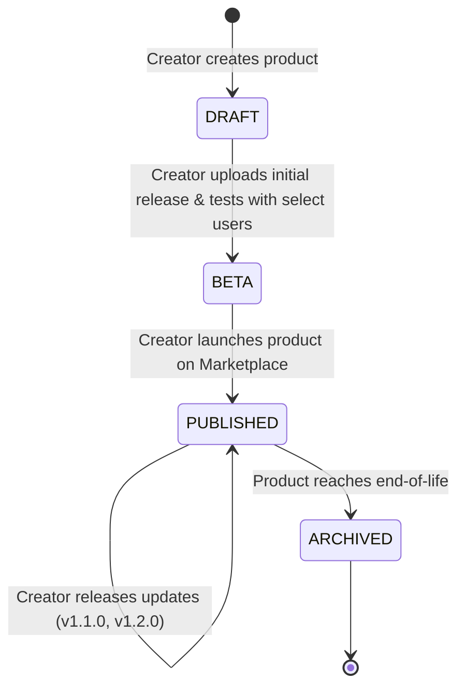
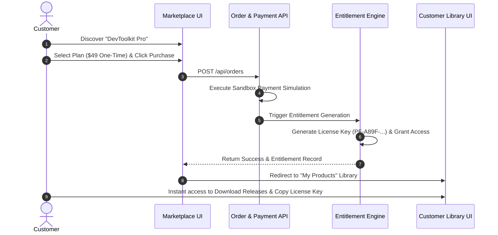
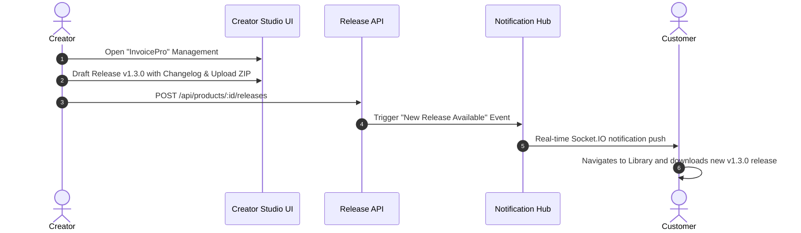

# ProductForge: End-to-End Project Workflow

## 1. Product Lifecycle State Machine

```mermaid
stateDiagram-v2
    [*] --> DRAFT : Creator creates product
    DRAFT --> BETA : Creator uploads initial release & tests with select users
    BETA --> PUBLISHED : Creator launches product on Marketplace
    PUBLISHED --> PUBLISHED : Creator releases updates (v1.1.0, v1.2.0)
    PUBLISHED --> ARCHIVED : Product reaches end-of-life
    ARCHIVED --> [*]
```

---

## 2. Customer Acquisition & Entitlement Workflow

```mermaid
sequenceDiagram
    autonumber
    actor Customer
    participant Market as Marketplace UI
    participant OrderAPI as Order & Payment API
    participant EntAPI as Entitlement Engine
    participant Library as Customer Library UI

    Customer->>Market: Discover "DevToolkit Pro"
    Customer->>Market: Select Plan ($49 One-Time) & Click Purchase
    Market->>OrderAPI: POST /api/orders
    OrderAPI->>OrderAPI: Execute Sandbox Payment Simulation
    OrderAPI->>EntAPI: Trigger Entitlement Generation
    EntAPI->>EntAPI: Generate License Key (PF-A89F-...) & Grant Access
    EntAPI-->>Market: Return Success & Entitlement Record
    Market->>Library: Redirect to "My Products" Library
    Customer->>Library: Instant access to Download Releases & Copy License Key
```

---

## 3. Product Release & Update Workflow

```mermaid
sequenceDiagram
    autonumber
    actor Creator
    participant Studio as Creator Studio UI
    participant RelAPI as Release API
    participant NotifAPI as Notification Hub
    actor Customer

    Creator->>Studio: Open "InvoicePro" Management
    Creator->>Studio: Draft Release v1.3.0 with Changelog & Upload ZIP
    Creator->>RelAPI: POST /api/products/:id/releases
    RelAPI->>NotifAPI: Trigger "New Release Available" Event
    NotifAPI->>Customer: Real-time Socket.IO notification push
    Customer->>Customer: Navigates to Library and downloads new v1.3.0 release
```
